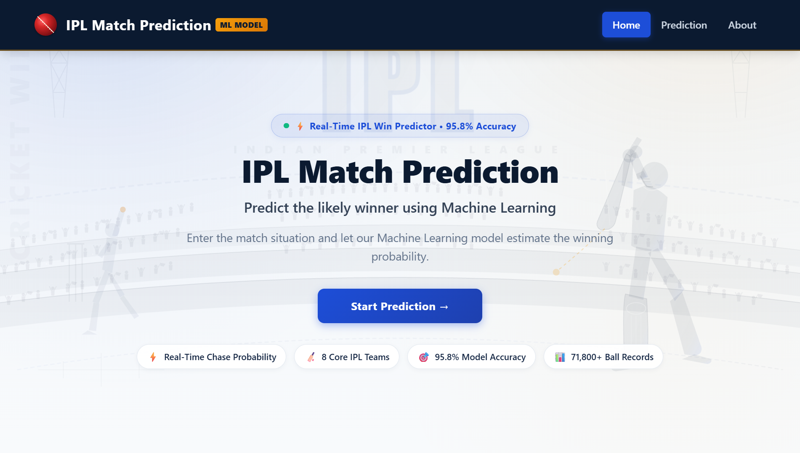
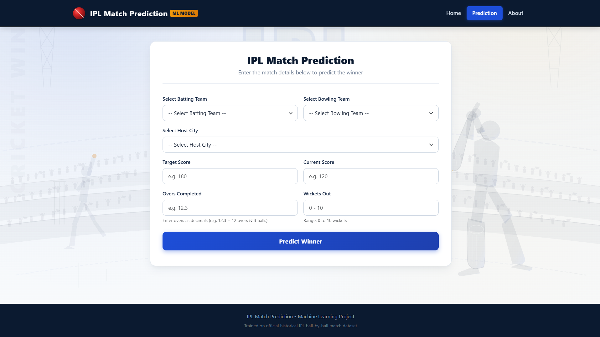
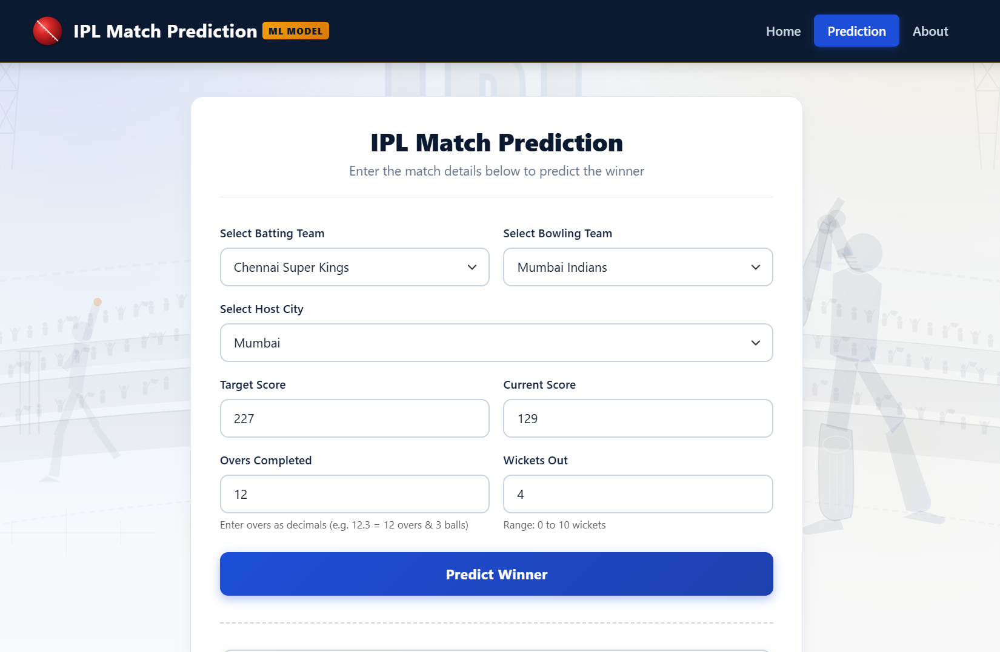
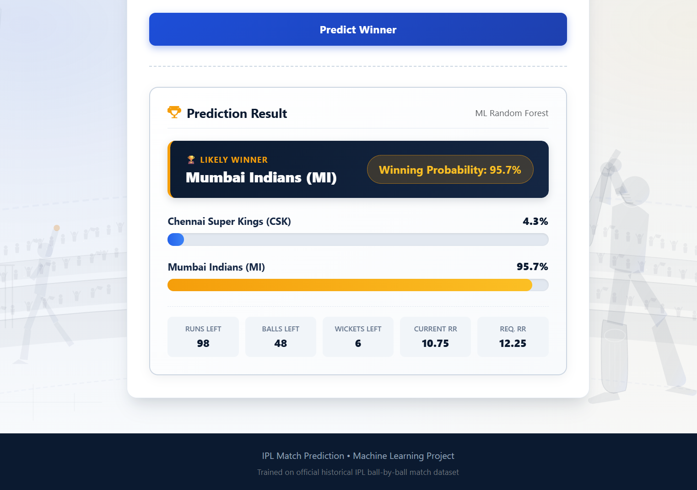
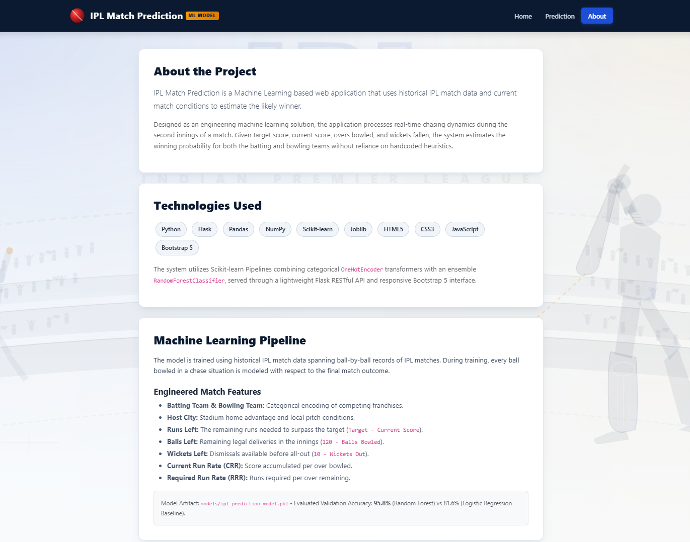

# IPL Match Prediction 🏏

An end-to-end Machine Learning web application designed to predict the winning team and real-time winning probabilities during the second innings of an Indian Premier League (IPL) cricket match.

Built using **Python, Flask, Scikit-learn, HTML5, CSS3, JavaScript, and Bootstrap 5**.

---

## 📌 Project Overview

**IPL Match Prediction** is an end-to-end Machine Learning web application that estimates match outcomes based on historical IPL data and live second-innings match situations.

Given match inputs such as batting team, bowling team, host city, target score, current score, overs completed, and wickets lost, the application calculates dynamic derived features:

- **Runs Left:** `Target - Current Score`
- **Balls Remaining:** `120 - Balls Bowled`
- **Wickets Remaining:** `10 - Wickets Lost`
- **Current Run Rate (CRR):** `(Current Score × 6) / Balls Bowled`
- **Required Run Rate (RRR):** `(Runs Left × 6) / Balls Remaining`

These features are processed through a Scikit-learn pipeline using **OneHotEncoder** for categorical features and a **RandomForestClassifier** for prediction.

The application returns the predicted winning probability of both teams through a responsive web interface without requiring a page reload.

---

## 🌟 Key Features

- **Machine Learning Pipeline:** Trained on historical IPL ball-by-ball match records with more than 71,800 game-state instances.
- **Random Forest Classification:** Achieved approximately **95.8% validation accuracy** in the current evaluation, compared with approximately **81.6% using Logistic Regression**.
- **Real-Time Match State Prediction:** Calculates runs left, balls remaining, wickets remaining, CRR, and RRR dynamically from user inputs.
- **Interactive Web Interface:** Users can enter the current match situation and receive instant win probabilities.
- **AJAX-Based Prediction:** Uses JavaScript `fetch()` API to communicate with the Flask backend without reloading the page.
- **Input Validation:** Validates teams, target score, current score, overs, wickets, and cricket-specific over notation.
- **Responsive UI:** Built with Bootstrap 5 and custom CSS for desktop, laptop, tablet, and mobile screens.
- **REST API:** Provides a `POST /predict` endpoint that can also be tested using tools such as Postman or cURL.
- **Prediction Visualization:** Displays the likely winner, winning probability, probability bars, and current chase statistics.

---

## 🛠️ Technology Stack

| Layer | Technologies |
| :--- | :--- |
| **Frontend** | HTML5, CSS3, JavaScript (ES6+ Fetch API), Bootstrap 5 |
| **Backend** | Python 3, Flask 3, Flask-CORS |
| **Machine Learning** | Scikit-learn, Pandas, NumPy, Joblib |
| **Model Architecture** | `Pipeline` with `ColumnTransformer`, `OneHotEncoder` & `RandomForestClassifier` |

---

## 📸 Application Screenshots

### 1. Landing Page

The landing page introduces the IPL Match Prediction system and highlights its major features and model performance.



---

### 2. Match Prediction Input

The prediction page allows users to select the batting team, bowling team, host city, target score, current score, overs completed, and wickets lost.

#### Empty Input State



#### Filled Match State



---

### 3. Prediction Result

After submitting the match situation, the application displays the predicted winner, winning probabilities, and real-time chase statistics.

The result includes:

- 🏆 Likely Winner
- Winning Probability
- Batting Team Probability
- Bowling Team Probability
- Runs Left
- Balls Left
- Wickets Left
- Current Run Rate (CRR)
- Required Run Rate (RRR)



---

### 4. Technology Stack & Project Interface



---

## 📊 Dataset Details

The project uses historical IPL match and ball-by-ball data.

### `matches.csv`

Contains high-level match information such as:

- Match ID
- Teams
- Date
- City
- Venue
- Toss information
- Match winner
- Match-related information

### `deliveries.csv`

Contains detailed ball-by-ball information including:

- Match ID
- Innings
- Over
- Ball
- Batsman
- Bowler
- Runs
- Wickets
- Other delivery-level information

### `data/ipl_matches.csv`

Contains the cleaned and feature-engineered second-innings chasing dataset used for Machine Learning.

The dataset contains approximately **71,859 game-state records**.

---

## 🏏 Supported Teams

The current application supports the following 8 core IPL franchises:

- Chennai Super Kings (CSK)
- Delhi Capitals (DC)
- Kings XI Punjab (PBKS)
- Kolkata Knight Riders (KKR)
- Mumbai Indians (MI)
- Rajasthan Royals (RR)
- Royal Challengers Bangalore (RCB)
- Sunrisers Hyderabad (SRH)

---

## 🤖 Machine Learning Workflow

The Machine Learning workflow follows these steps:

```text
Historical IPL Data
        ↓
Data Cleaning
        ↓
Team Name Normalization
        ↓
Second-Innings Data Selection
        ↓
Feature Engineering
        ↓
Train/Test Split
        ↓
OneHotEncoder
        ↓
Model Training
        ↓
Model Evaluation
        ↓
Random Forest Selection
        ↓
Save Trained Model
```

### Features Used

```text
batting_team
bowling_team
city
runs_left
balls_left
wickets_left
target
crr
rrr
```

### Classification Target

```text
0 → Bowling Team Wins
1 → Batting Team Wins
```

---

## 🌲 Model Performance

Two classification algorithms were evaluated:

### Logistic Regression

```text
Validation Accuracy: 81.56%
```

### Random Forest

```text
Validation Accuracy: 95.82%
```

The Random Forest model performed better on the current validation setup and was therefore selected for the final application.

### Classification Report

```text
                       precision    recall    f1-score    support
Bowling Team Wins (0)     0.97      0.96       0.96        7814
Batting Team Wins (1)     0.95      0.96       0.95        6558

accuracy                                      0.96       14372
```

> **Note:** The reported accuracy represents the current validation setup. Since the dataset contains multiple game-state records from the same match, a match-level train/test split would provide a more robust estimate of real-world generalization.

---

## 📁 Project Directory Structure

```text
IPL Win Predictor/
├── app.py                     # Flask web server and /predict REST API
├── train_model.py             # Script to load data, clean, train ML model, evaluate & save
├── requirements.txt           # Python dependencies
├── README.md                  # Complete documentation
│
├── data/
│   ├── deliveries.csv         # Raw historical ball-by-ball deliveries
│   ├── matches.csv            # Raw historical match results
│   └── ipl_matches.csv        # Preprocessed chasing match-situation dataset
│
├── models/
│   ├── ipl_prediction_model.pkl # Trained Scikit-learn Pipeline
│   └── model_metadata.json      # Saved model metadata, teams, and city lists
│
├── templates/
│   ├── base.html              # Shared navbar, branding, and layout structure
│   ├── index.html             # Home page with hero section & navigation
│   ├── prediction.html        # Main prediction page with input form & result card
│   └── about.html             # Project details, technologies & pipeline explanation
│
└── static/
    ├── css/
    │   └── style.css          # Navy-blue themed CSS styling & responsive adjustments
    ├── js/
    │   └── prediction.js      # Frontend validation, AJAX submission, and animation logic
    └── images/
        └── cricket_ball.svg   # Vector cricket ball brand icon
```

---

## ⚙️ Installation & Setup

### 1. Clone or Open the Repository

```bash
cd "IPL Win Predictor"
```

### 2. Create a Virtual Environment

#### Windows

```powershell
python -m venv venv
.\venv\Scripts\activate
```

#### macOS / Linux

```bash
python3 -m venv venv
source venv/bin/activate
```

### 3. Install Dependencies

```bash
pip install -r requirements.txt
```

---

## 🚀 Running the Project

### 1. Train the Machine Learning Model

The pre-trained model is already included in:

```text
models/ipl_prediction_model.pkl
```

Training is optional unless you want to retrain the model or view the evaluation statistics.

```bash
python train_model.py
```

Example output:

```text
==================================================
EXPERIMENT 1: Logistic Regression Classifier
==================================================
Logistic Regression Validation Accuracy: 81.56%

==================================================
EXPERIMENT 2: Random Forest Classifier
==================================================
Random Forest Validation Accuracy: 95.82%
```

### 2. Start the Flask Application

```bash
python app.py
```

### 3. Open the Application

```text
http://127.0.0.1:5000
```


---

## 📖 How to Use the Prediction Page

1. Open the **Prediction** page.
2. Select the **Batting Team**.
3. Select the **Bowling Team**.
4. Select the **Host City**.
5. Enter the **Target Score**.
6. Enter the **Current Score**.
7. Enter the **Overs Completed**.
8. Enter the **Wickets Lost**.
9. Click **Predict Winner**.
10. The application calculates the required match-state features.
11. The trained Random Forest model generates the win probabilities.
12. The result is displayed dynamically on the page.

### Example Input

```text
Batting Team: Mumbai Indians
Bowling Team: Chennai Super Kings
City: Mumbai
Target: 180
Current Score: 120
Overs: 15.0
Wickets: 4
```

### Derived Statistics

```text
Runs Left: 60
Balls Left: 30
Wickets Left: 6
CRR: 8.0
RRR: 12.0
```

---

## 📡 REST API

### `POST /predict`

The application exposes a REST API for generating predictions.

### Request Headers

```text
Content-Type: application/json
```

### Request Body

```json
{
  "batting_team": "Mumbai Indians",
  "bowling_team": "Chennai Super Kings",
  "city": "Mumbai",
  "target": 180,
  "current_score": 120,
  "overs": 15.0,
  "wickets": 4
}
```

### Response

```json
{
  "success": true,
  "winner": "Mumbai Indians (MI)",
  "likely_winner_raw": "Mumbai Indians",
  "batting_team": "Mumbai Indians",
  "bowling_team": "Chennai Super Kings",
  "batting_team_abbr": "MI",
  "bowling_team_abbr": "CSK",
  "batting_team_probability": 0.6861,
  "bowling_team_probability": 0.3139,
  "batting_win_percentage": 68.6,
  "bowling_win_percentage": 31.4,
  "winning_probability_pct": 68.6,
  "stats": {
    "runs_left": 60,
    "balls_left": 30,
    "wickets_left": 6,
    "crr": 8.0,
    "rrr": 12.0
  }
}
```

---

## 🛡️ Input Validation & Error Handling

The application validates user inputs before making a prediction.

It handles:

- Identical batting and bowling teams.
- Unsupported or invalid teams.
- Invalid city values.
- Target score less than or equal to zero.
- Negative current score.
- Current score equal to or greater than the target.
- Invalid overs format.
- Overs greater than 20.
- Invalid ball notation such as `12.7`.
- Wickets below 0 or above 10.
- Missing ML model files.

The API returns appropriate HTTP error responses and human-readable error messages.

---

## 🔄 Application Workflow

```text
User
 ↓
Prediction Page
 ↓
Enter Match Situation
 ↓
JavaScript Validation
 ↓
POST /predict
 ↓
Flask Backend
 ↓
Calculate Match-State Features
 ↓
OneHotEncoder + Random Forest
 ↓
Win Probability
 ↓
JSON Response
 ↓
JavaScript
 ↓
Dynamic Result Display
```

---

## 📌 Project Highlights

This project demonstrates the complete Machine Learning application lifecycle:

```text
Data Collection
      ↓
Data Cleaning
      ↓
Feature Engineering
      ↓
Machine Learning
      ↓
Model Evaluation
      ↓
Model Serialization
      ↓
Flask Backend
      ↓
REST API
      ↓
Interactive Frontend
      ↓
Real-Time Prediction
```

The project combines **Machine Learning, Python backend development, REST APIs, frontend development, data preprocessing, and interactive data presentation** into a single end-to-end application.

---

## 🔮 Future Improvements

Possible future improvements include:

- Match-level train/test splitting for more reliable model evaluation.
- Addition of player-level performance features.
- Toss winner and toss decision as additional features.
- Venue and pitch-related information.
- Recent player/team performance.
- Weather and pitch conditions.
- Live IPL score API integration.
- Model probability calibration.
- Deployment on a cloud platform.
- Support for more IPL teams and recent seasons.

---

## 👨‍💻 Author

**Ayush Satishrao Kurhade**

AI & Data Science Student | Java Developer | Data & Business Analytics

- GitHub: [AyushKurhade](https://github.com/AyushKurhade)
- LinkedIn: [Ayush Kurhade](https://linkedin.com/in/ayushk30)

---

## ⭐ If You Like This Project

If you find this project useful, consider giving the repository a ⭐ on GitHub.
